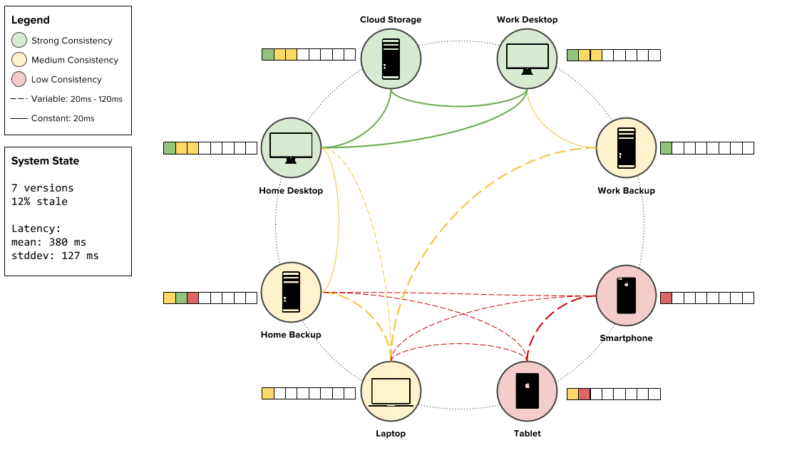

# CloudScope

**Visualization of distributed systems and communications.**

## Basic Plan

Right now the plan is to have the `cloudscope` package generate a static site, which will then be placed into the `gh-pages` repository for hosting. A simple static web server can serve that site for development. Generation of the static site, in this case, is simply the generation of JSON data from graphs that are constructed by the `cloudscope` utility.

## About

Simple repository to visualize examples of data flow in distributed systems. Inspired by [The Secret Lives of Data](http://thesecretlivesofdata.com/raft/) and [RaftScope](https://github.com/ongardie/raftscope).

## Changelog

The release versions that are tagged in Git. You can see the tags through the GitHub web application and download the tarball of the version you'd like.

The versioning uses a three part version system, "a.b.c" - "a" represents a major release that may not be backwards compatible. "b" is incremented on minor releases that may contain extra features, but are backwards compatible. "c" releases are bug fixes or other micro changes that developers should feel free to immediately update to.

### Version 0.3

* **tag**: [v0.3](https://github.com/bbengfort/cloudscope/releases/tag/v0.3)
* **deployment**: Tuesday, February 23, 2016
* **commit**: (see tag)

This version implements the initial simulation prototype, and in particular handles eventual consistency and Raft quorum consistency. The two simulations that have been run and validated are homogenous consistency topologies (e.g. all eventual or all Raft). This version highlights the motivating examples for our work.

### Early Releases

Earlier releases that had the version 0.1 and 0.2 versions were MVP prototypes for the web visualization and the basic simulation. These releases organized differently, so they are not tagged in GitHub.
