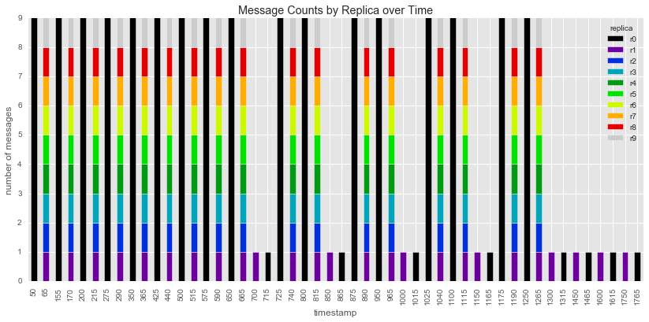
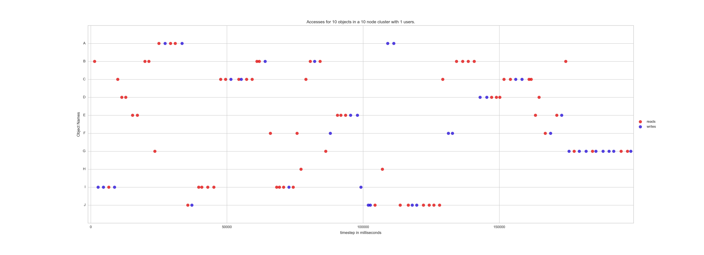
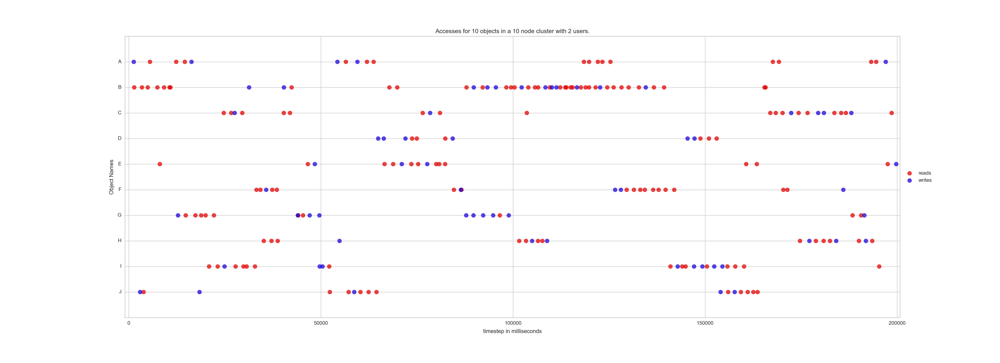
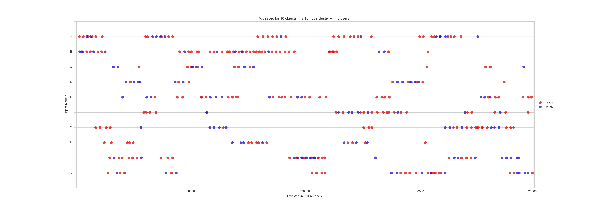
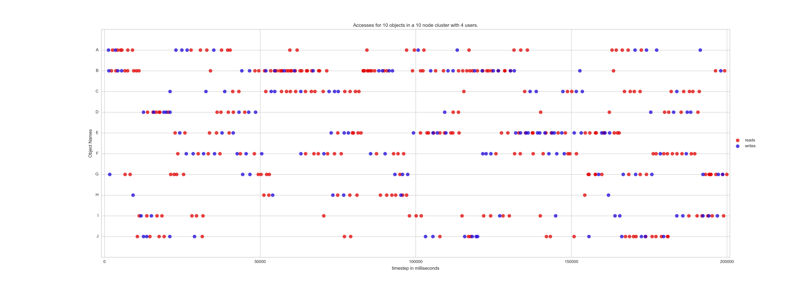

# Workload

A workload is a "trace" of accesses by one or more users in a distributed system. There are two types of accesses to objects currently: read and write. The trace defines the timestamp, the replica, the user, and access type of the access, thus creating a time series of accesses.

## Deterministic Workload

In order to more closely simulate the real world, our simulation has the ability to read in the trace from a file. It is our hope to gather data to put into this form so that the trace is implemented on real world data. We have several small traces that were built manually, including a 9 access trace with reads and writes that causes the following message pattern in the system:

## Stochastic Workload

The other option is to generate random accesses based on a read/write frequency and normal distribution of time from last access. The workload increases as the number of users increases as can be seen by the workloads for 1,2,3, and 4 users below:

